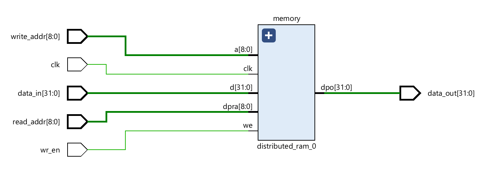

# IITK-Mini-MIPS

## Design and Constraints

## Instructions

### R-type Instructions

|      Instruction      | Opcode | Function |                         Meaning                          |    Notes    |
|-----------------------|--------|----------|----------------------------------------------------------|-------------|
| `add   rd, rs, rt`    |  0x0   |   0x20   | Add                                                      |             |
| `sub   rd, rs, rt`    |  0x0   |   0x22   | Subtract                                                 |             |
| `addu  rd, rs, rt`    |  0x0   |   0x21   | Add unsigned                                             |             |
| `subu  rd, rs, rt`    |  0x0   |   0x23   | Subtract unsigned                                        |             |
| `madd  rs, rt`        |  0x1c  |   0x0    | Integer multiply-add                                     | `rd = 0`    |
| `maddu rs, rt`        |  0x1c  |   0x1    | Unsigned integer multiply-add                            | `rd = 0`    |
| `mul   rs, rt`        |  0x0   |   0x18   | Multiply into {hi, lo}                                   | `rd = 0`    |
| `and   rd, rs, rt`    |  0x0   |   0x24   | Bitwise AND                                              |             |
| `or    rd, rs, rt`    |  0x0   |   0x25   | Bitwise OR                                               |             |
| `not   rd, rt`        |        |          | Bitwise NOT                                              |             |
| `xor   rd, rs, rt`    |  0x0   |   0x26   | Bitwise XOR                                              |             |
| `sll   rd, rt, shamt` |  0x0   |   0x0    | Shift left logical                                       |             |
| `srl   rd, rt, shamt` |  0x0   |   0x2    | Shift right logical                                      |             |
| `sla   rd, rt, shamt` |  0x0   |   0x0    | Shift left arithmetic                                    |             |
| `sra   rd, rt, shamt` |  0x0   |   0x3    | Shift right arithmetic                                   |             |
| `slt   rd, rs, rt`    |  0x0   |   0x2a   | Set on less than                                         |             |
| `jr    rs`            |  0x0   |   0x8    | Jump register                                            |             |

### I-type Instructions

|      Instruction      | Opcode |                         Meaning                          |              Notes              |
|-----------------------|--------|----------------------------------------------------------|---------------------------------|
| `addi  rt, rs, imm`   |  0x8   | Add immediate                                            |                                 |
| `addiu rt, rs, imm`   |  0x9   | Add unsigned immediate                                   |                                 |
| `andi  rt, rs, imm`   |  0xc   | Bitwise AND immediate                                    |                                 |
| `ori   rt, rs, imm`   |  0xd   | Bitwise OR immediate                                     |                                 |
| `xori  rt, rs, imm`   |  0xe   | Bitwise XOR immediate                                    |                                 |
| `lw    rt, off(rs)`   |  0x23  | Load word                                                |                                 |
| `sw    rt, off(rs)`   |  0x2b  | Store word                                               |                                 |
| `lui   rt, imm`       |  0xf   | Load upper immediate                                     |                                 |
| `beq   rt, rs, label` |  0x4   | Branch on equal                                          |                                 |
| `bne   rt, rs, label` |  0x5   | Branch on not equal                                      |                                 |
| `bgt   rt, rs, label` |  0x7   | Branch on greater than                                   |                                 |
| `bgte  rt, rs, label` |  0x1   | Branch on greater than or equal                          |                                 |
| `ble   rt, rs, label` |  0x1   | Branch on less than                                      | Same as `bgte  rs, rt, label`   |
| `bleq  rt, rs, label` |  0x7   | Branch on less than or equal                             | Same as `bgt   rs, rt, label`   |
| `bleu  rt, rs, label` |        | Branch on less than unsigned                             |                                 |
| `bgtu  rt, rs, label` |        | Branch on greater than unsigned                          |                                 |
| `slti  rt, rs, imm`   |  0xa   | Set on less than immediate                               |                                 |
| `seq   rt, rs, imm`   |        | Set on equal immediate                                   |                                 |

### J-type Instructions

|      Instruction      | Opcode |                         Meaning                          |              Notes              |
|-----------------------|--------|----------------------------------------------------------|---------------------------------|
| `j     label`         |  0x2   | Unconditional jump                                       |                                 |
| `jal   label`         |  0x3   | Jump and link                                            |                                 |

## Components

### Instruction Memory

The instruction memory has a word size of exactly 32 bits. The implementation
uses a simple dual port distributed RAM for the instruction memory.

### Register File

The register file contains 32 general-purpose registers of width 32 bits each.
The registers are labelled `$0` through `$31`, and their respective addresses
in the implementation are 0 through 31. Register `$0` is hardwired to zero;
writes to it are discarded.

The schematic can be viewed [here](register_file_schematic.pdf).

Although the schematic displays a dummy register for register `$0`, only
writes are performed to it. The output corresponding to 0 for the mux select
is hardwired to ground; as such, the register has no meaningful role and
should ideally be optimised out.