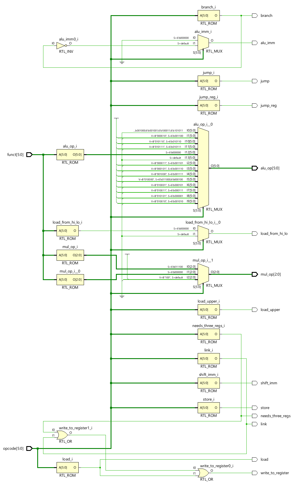
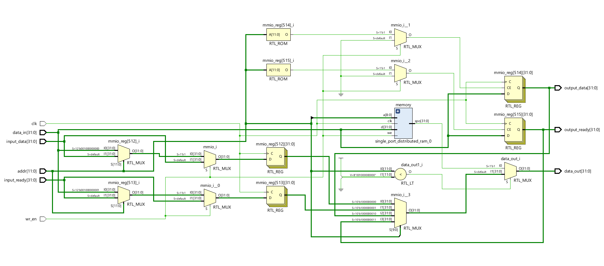
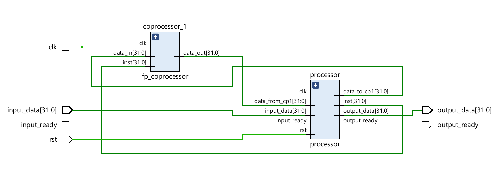

# IITK Mini-MIPS

## Instructions

### R-type Instructions

|      Instruction      | Opcode | Function |                         Meaning                          |             Notes             |
|-----------------------|--------|----------|----------------------------------------------------------|-------------------------------|
| `add   rd, rs, rt`    |  0x0   |   0x20   | Add                                                      |                               |
| `sub   rd, rs, rt`    |  0x0   |   0x22   | Subtract                                                 |                               |
| `addu  rd, rs, rt`    |  0x0   |   0x21   | Add unsigned                                             |                               |
| `subu  rd, rs, rt`    |  0x0   |   0x23   | Subtract unsigned                                        |                               |
| `madd  rs, rt`        |  0x1c  |   0x0    | Integer multiply-add                                     | `rd = 0` (discard writes)     |
| `maddu rs, rt`        |  0x1c  |   0x1    | Unsigned integer multiply-add                            | `rd = 0` (discard writes)     |
| `mul   rs, rt`        |  0x0   |   0x18   | Multiply into `{hi, lo}`                                 | `rd = 0` (discard writes)     |
| `and   rd, rs, rt`    |  0x0   |   0x24   | Bitwise AND                                              |                               |
| `or    rd, rs, rt`    |  0x0   |   0x25   | Bitwise OR                                               |                               |
| `not   rd, rt`        |  0x0   |   0x27   | Bitwise NOT                                              |                               |
| `xor   rd, rs, rt`    |  0x0   |   0x26   | Bitwise XOR                                              |                               |
| `sll   rd, rt, shamt` |  0x0   |   0x0    | Shift left logical                                       |                               |
| `srl   rd, rt, shamt` |  0x0   |   0x2    | Shift right logical                                      |                               |
| `sla   rd, rt, shamt` |  0x0   |   0x0    | Shift left arithmetic                                    |                               |
| `sra   rd, rt, shamt` |  0x0   |   0x3    | Shift right arithmetic                                   |                               |
| `slt   rd, rs, rt`    |  0x0   |   0x2a   | Set on less than                                         |                               |
| `jr    rs`            |  0x0   |   0x8    | Jump register                                            | `rt = rd = 0`                 |
| `mfhi  rd`            |  0x0   |   0x10   | Move from `hi`                                           | `rs = rt = 0`                 |
| `mflo  rd`            |  0x0   |   0x12   | Move from `lo`                                           | `rs = rt = 0`                 |

### I-type Instructions

|      Instruction      | Opcode |                         Meaning                          |              Notes              |
|-----------------------|--------|----------------------------------------------------------|---------------------------------|
| `addi  rt, rs, imm`   |  0x8   | Add immediate                                            |                                 |
| `addiu rt, rs, imm`   |  0x9   | Add unsigned immediate                                   |                                 |
| `andi  rt, rs, imm`   |  0xc   | Bitwise AND immediate                                    |                                 |
| `ori   rt, rs, imm`   |  0xd   | Bitwise OR immediate                                     |                                 |
| `xori  rt, rs, imm`   |  0xe   | Bitwise XOR immediate                                    |                                 |
| `lw    rt, off(rs)`   |  0x23  | Load word                                                |                                 |
| `sw    rt, off(rs)`   |  0x2b  | Store word                                               |                                 |
| `lui   rt, imm`       |  0xf   | Load upper immediate                                     |                                 |
| `beq   rs, rt, label` |  0x4   | Branch on equal                                          |                                 |
| `bne   rs, rt, label` |  0x5   | Branch on not equal                                      |                                 |
| `bgt   rs, rt, label` |  0x7   | Branch on greater than                                   |                                 |
| `bgte  rs, rt, label` |  0x1   | Branch on greater than or equal                          |                                 |
| `ble   rs, rt, label` |  0x1   | Branch on less than                                      | Same as `bgte  rt, rs, label`   |
| `bleq  rs, rt, label` |  0x7   | Branch on less than or equal                             | Same as `bgt   rt, rs, label`   |
| `bleu  rs, rt, label` |  0x16  | Branch on less than unsigned                             |                                 |
| `bgtu  rs, rt, label` |  0x17  | Branch on greater than unsigned                          |                                 |
| `slti  rs, rt, imm`   |  0xa   | Set on less than immediate                               |                                 |
| `seq   rs, rt, imm`   |  0x18  | Set on equal immediate                                   |                                 |

### J-type Instructions

|      Instruction      | Opcode |                         Meaning                          |              Notes              |
|-----------------------|--------|----------------------------------------------------------|---------------------------------|
| `j     label`         |  0x2   | Unconditional jump                                       |                                 |
| `jal   label`         |  0x3   | Jump and link                                            |                                 |

## Components

### Instruction Memory

The instruction memory has a word size of exactly 32 bits. The implementation
uses a simple dual port distributed RAM for the instruction memory. Unaligned
accesses are not allowed and fail silently.

Programs can be loaded into the instruction memory using coefficient files
(COE files); see the [readme](../README.md) for details.

### Program Counter

The program counter holds the address of the instruction to fetch in the next
cycle. The program counter is 32 bits wide and is implemented the same way as
a general-purpose register (see below).

### Register File

The register file contains 32 general-purpose registers of width 32 bits each.
The registers are labelled `$0` through `$31`, and their respective addresses
in the implementation are 0 through 31. Register `$0` is hardwired to zero;
writes to it are discarded.

The schematic can be viewed [here](assets/register_file_schematic.pdf).

Each register is implemented as a collection of 32 D flip-flops, each storing
one bit.

### Instruction Decoder

The instruction decoder uses the instruction opcode and, in case of R-type
instructions, the *funct* field, to set or reset various control signals.

| Control Signal         | Effect                                                                                                                           |
|------------------------|----------------------------------------------------------------------------------------------------------------------------------|
| `needs_three_regs`     | If high, `inst[15:11]` is used as the index for the register to write to.                                                        |
| `jump`                 | If high, the program counter is updated with the jump address.                                                                   |
| `jump_reg`             | If high, the jump address is taken from the value at read port 1 of the register file. Else, it is taken from the instruction.   |
| `load`                 | If high, feeds the write port of the register file with the data at the read port of the data memory.                            |
| `store`                | If high, sets the write enable of the data memory.                                                                               |
| `link`                 | If high, writes to register `$ra` the program counter's value incremented by 4.                                                  |
| `alu_imm`              | If high, `inst[15:0]` is used as the second operand of the ALU.                                                                  |
| `shift_imm`            | If high, `inst[10:6]` is used as the first operand of the ALU.                                                                   |
| `load_upper`           | If high, `16` is used as the first operand of the ALU.                                                                           |
| `branch`               | If high, the program counter is updated with the branch address if the branch condition evaluates to true.                       |
| `write_to_register`    | If high, the register file's write enable is asserted. Else, it is deasserted.                                                   |
| `load_from_hi_lo`      | If high, the second operand of the ALU is sourced from the output of the multiply unit.                                          |

### Arithmetic and Logic Unit

The ALU supports addition and subtraction of integers, bitwise operations
(including bit shifts), and comparison between integers. The operations can
be performed with signed (2's complement) as well as unsigned integers.

The schematic can be viewed [here](assets/alu_schematic.pdf).

Arithmetic and relational operations require sign-extension of immediate
operands, while bitwise operators require zero-extension of immediate
operands. Sign- and zero-extension are performed by the ALU itself, with
the various components receiving appropriate arguments based on the opcode.

### Multiply Unit

Multiplication in MIPS is different from other instructions in that the
result is stored in two special registers named `hi` and `lo`. The contents
of these registers cannot be accessed or used without first moving them to
general-purpose registers; therefore, there are special instructions for the
same, handled by the multiply unit.

The hardware for multiplication and fused multiply-addd, as well as the
`hi` and `lo` registers, are contained in the multiply unit, separate
from the ALU. The `hi` and `lo` registers are implemented the same way
as general-purpose registers.

### Data Memory

The data memory has a word size of exactly 32 bits. The implementation
uses a single port distributed RAM for the instruction memory.
Unaligned accesses are not allowed and fail silently.

Addresses 512 to 515 are used for memory-mapped I/O.

- Address 512 receives input data; once the data is ready, the value `1` is
stored at address 513 by the input device to indicate that input is complete.
In the next cycle, `0` is written to address 513.

- Address 514 receives output data; once the data is ready,
  the program must store the value `1` at address 515. In the
  next cycle, the program should store `0` at the address
  (unless multiple words of data are being output in one go).

### Floating Point Coprocessor

The processor is equipped with a floating point coprocessor with 32
floating point registers, 8 conditional flags, and a dedicated
instruction decoder. The FPU is capable of addition, subtraction, and
comparison of IEEE-754 single-precision floats.

The schematic can be viewed [here](assets/floating_point_coprocessor_schematic.pdf).

## Overall Design

